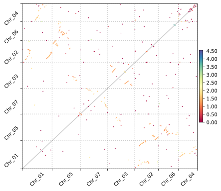

Recipes
=====

.. _paranome:

Whole paranome inference
------------

Here we used the real coding sequence data of a basal eudicot, *Aquilegia coerulea* to conduct the analysis. The command we used is as below.

.. code-block:: console

   (ENV)$ wgd dmd Aquilegia_coerulea

By default, the output directory is named as ``wgd_dmd`` locating at the same directory as the script. The output file name inside is ``Aquilegia_coerulea.tsv``. In short, the workflow of this step is ``diamond + normalization + mcl``, as shown below.

.. image:: wgd_dmd.svg

.. _ks:

*K*\ :sub:`S` distribution construction
------------

To build the *K*\ :sub:`S` distribution, with the paralogous gene families inferred above, we use the command below.

.. code-block:: console

   (ENV)$ wgd ksd wgd_dmd/Aquilegia_coerulea.tsv Aquilegia_coerulea

.. image:: Aquilegia_coerulea.tsv.ksd_wp.svg

The anchor *K*\ :sub:`S` distribution can be further constructed by the program ``wgd syn`` with the command below.

.. code-block:: console

   (ENV)$ wgd syn -f mRNA -a Name wgd_dmd/Aquilegia_coerulea.tsv Aquilegia_coerulea.gff3 -ks wgd_ksd/Aquilegia_coerulea.tsv.ks.tsv

.. image:: Aquilegia_coerulea.tsv.ksd_wp_ap.svg

.. _syntenyrecipe:

Synteny inference
------------

Associated with the anchor *K*\ :sub:`S` distribution, there are some other probably interesting syntenic plots also being produced from the command above. One is the Syndepth plot shown below, which reflects that *A. coerulea* has numerous duplicated collinear segments and a few triplicated collinear segmentsretained.

.. image:: Syndepth.svg

Besides, the dupStack plot shows more intuitively the distribution of duplicated segments across the chromosomes.

.. image:: Aquilegia_coerulea_Aquilegia_coerulea_multiplicons_level.svg

The dotplot in oxford grid in the unit of nucleotides will also be automately produced.

.. image:: Aquilegia_coerulea-vs-Aquilegia_coerulea.dot.png

Another dotplot in the unit of genes colored by the median *K*\ :sub:`S` age of anchor pairs on segment is also there.

.. _mixturerecipe:

Mixture modeling
------------

To gain a model-based view of when there might be likely WGD peaks, we can conduct an exponential-lognormal mixture modeling using the command below.

.. code-block:: console

   (ENV)$ wgd viz -d wgd_ksd/Aquilegia_coerulea.tsv.ks.tsv

.. image:: elmm_Aquilegia_coerulea.tsv.ks.tsv_best_models_weighted.svg

Above we just did a mixture modeling analysis for the whole paranome, we can do another Gaussian mixture modeling upon the anchor *K*\ :sub:`S` using the command below.

.. code-block:: console

   (ENV)$ wgd peak wgd_ksd/Aquilegia_coerulea.tsv.ks.tsv --anchorpoints wgd_syn/iadhore-out/anchorpoints.txt --segments wgd_syn/iadhore-out/segments.txt --listelements wgd_syn/iadhore-out/list_elements.txt --multipliconpairs wgd_syn/iadhore-out/multiplicon_pairs.txt --weighted

.. image:: Original_AnchorKs_GMM_Component3_node_weighted_Lognormal.svg

.. _correctionrecipe:

Substitution rate correction
------------

On the whole, the likely WGD peak around the *K*\ :sub:`S` age 1.2 and numerous duplicated collinear segments suggest a paleo-polyploidization event. To resolve its phylogenetic location, for instance, whether it's shared by all eudicots or limited to *A. coerulea*, we can conduct a rate-correction analysis and directly compare the relative timing of polyploidization and speciation event. To achieve the goal, we firstly have to calculate the orthologous *K*\ :sub:`S` distribution, using the command below.

.. code-block:: console

   (ENV)$ wgd dmd --globalmrbh Aquilegia_coerulea Protea_cynaroides Acorus_americanus Vitis_vinifera -o wgd_globalmrbh
   (ENV)$ wgd ksd wgd_globalmrbh/global_MRBH.tsv --extraparanomeks wgd_ksd/Aquilegia_coerulea.tsv.ks.tsv -sp speciestree.nw --reweight -o wgd_globalmrbh_ks --spair "Aquilegia_coerulea;Protea_cynaroides" --spair "Aquilegia_coerulea;Vitis_vinifera" --spair "Aquilegia_coerulea;Acorus_americanus" --spair "Aquilegia_coerulea;Aquilegia_coerulea" --plotkde (-ap wgd_syn/iadhore-out/anchorpoints.txt)

The first ``wgd dmd`` command is to infer the global MRBH families as preparatory files. The second ``wgd ksd`` command is doing two things, 1) calculating the orthologous *K*\ :sub:`S` values and 2) conducting rate-correction. Here the users are required to provide explicitly the species pairs to be plotted and the species tree file in newick format to properly conduct rate-correction. The anchor pairs information can be optionally provided by using the option ``anchorpoints``.

.. image:: Aquilegia_coerulea_GlobalmrbhKs_Corrected.ksd.svg
