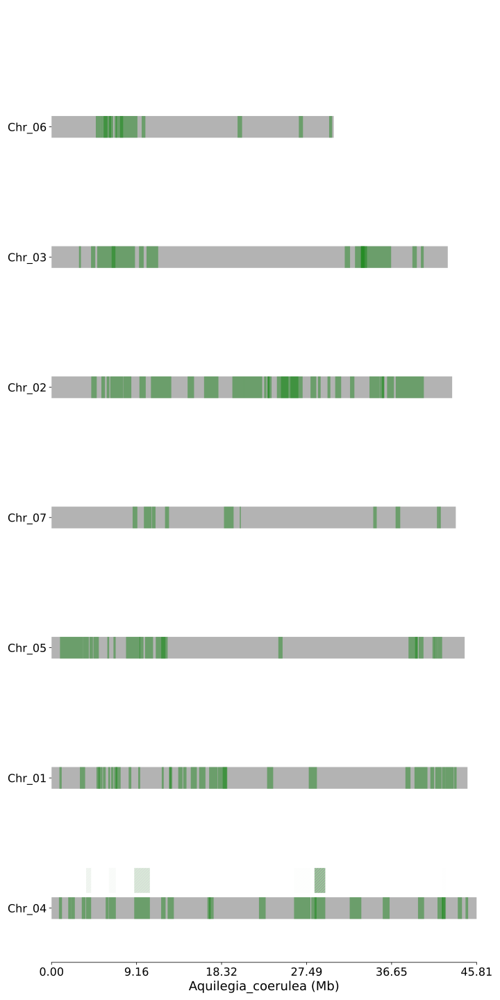
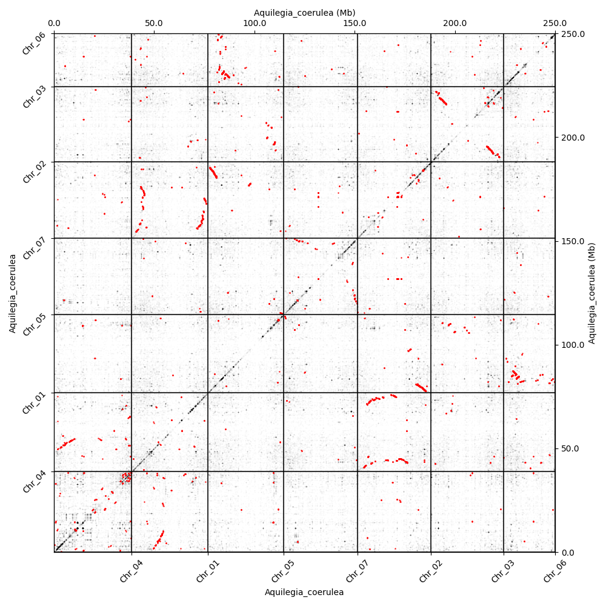

Recipes
=====

.. _paranome:

Whole paranome inference
------------

Here we used the real coding sequence data of a basal eudicot, *Aquilegia coerulea* to conduct the analysis. The command we used is as below.

.. code-block:: console

   (ENV)$ wgd dmd Aquilegia_coerulea

By default, the output directory is named as ``wgd_dmd`` locating at the same directory as the script. The output file name inside is ``Aquilegia_coerulea.tsv``. In short, the workflow of this step is ``diamond + normalization + mcl``, as shown below.

.. image:: wgd_dmd.svg

.. _ks:

*K*\ :sub:`S` distribution construction
------------

To build the *K*\ :sub:`S` distribution, with the paralogous gene families inferred above, we use the command below.

.. code-block:: console

   (ENV)$ wgd ksd wgd_dmd/Aquilegia_coerulea.tsv Aquilegia_coerulea

.. image:: Aquilegia_coerulea.tsv.ksd_wp.svg

The anchor *K*\ :sub:`S` distribution can be further constructed by the program ``wgd syn`` with the command below.

.. code-block:: console

   (ENV)$ wgd syn -f mRNA -a Name wgd_dmd/Aquilegia_coerulea.tsv Aquilegia_coerulea.gff3 -ks wgd_ksd/Aquilegia_coerulea.tsv.ks.tsv

.. image:: Aquilegia_coerulea.tsv.ksd_wp_ap.svg

.. _syntenyrecipe:

Synteny inference
------------

Associated with the anchor *K*\ :sub:`S` distribution, there are some other probably interesting syntenic plots also being produced from the command above. One is the Syndepth plot shown below, which reflects that *A. coerulea* has numerous duplicated collinear segments and a few triplicated collinear segmentsretained.

Besides, the dupStack plot shows more intuitively the distribution of duplicated segments across the chromosomes.

The dotplot in oxford grid in the unit of nucleotides and genes will also be automately produced with *K*\ :sub:`S` annotated.

.. image:: Aquilegia_coerulea-vs-Aquilegia_coerulea_Ks.dot_unit_gene.png

The ones above are with *K*\ :sub:`S` annotation, the ones without *K*\ :sub:`S` annotation are as below.

.. image:: Aquilegia_coerulea-vs-Aquilegia_coerulea.dot_unit_gene.png

.. note::

   The opacity of anchor dots and all homolog dots can be set by the option ``apalpha`` and ``hoalpha`` separately. If one just wants to see the anchor dots, setting the `hoalpha` as 0 (or other minuscule values) will do. If one wants to see the distribution of whole dots better, setting the `hoalpha` higher (and `apalpha` lower) will do. The ``dotsize`` option can be called to adjust the size of dots.

.. _mixturerecipe:

Mixture modeling
------------

To gain a model-based view of when there might be likely WGD peaks, we can conduct an exponential-lognormal mixture modeling (ELMM) using the command below.

.. code-block:: console

   (ENV)$ wgd viz -d wgd_ksd/Aquilegia_coerulea.tsv.ks.tsv

Above we just did a mixture modeling analysis for the whole paranome, we can do another Gaussian mixture modeling upon the anchor *K*\ :sub:`S` using the command below.

.. code-block:: console

   (ENV)$ wgd peak wgd_ksd/Aquilegia_coerulea.tsv.ks.tsv --anchorpoints wgd_syn/iadhore-out/anchorpoints.txt --segments wgd_syn/iadhore-out/segments.txt --listelements wgd_syn/iadhore-out/list_elements.txt --multipliconpairs wgd_syn/iadhore-out/multiplicon_pairs.txt --weighted

.. image:: Original_AnchorKs_GMM_Component3_node_weighted_Lognormal.svg

.. _correctionrecipe:

Substitution rate correction
------------

On the whole, the likely WGD peak around the *K*\ :sub:`S` age 1.2 and numerous duplicated collinear segments suggest a paleo-polyploidization event. To resolve its phylogenetic location, for instance, whether it's shared by all eudicots or limited to *A. coerulea*, we can conduct a rate-correction analysis and directly compare the relative timing of polyploidization and speciation event. To achieve the goal, we firstly have to calculate the orthologous *K*\ :sub:`S` distribution, using the command below.

.. code-block:: console

   (ENV)$ wgd dmd --globalmrbh Aquilegia_coerulea Protea_cynaroides Acorus_americanus Vitis_vinifera -o wgd_globalmrbh
   (ENV)$ wgd ksd wgd_globalmrbh/global_MRBH.tsv --extraparanomeks wgd_ksd/Aquilegia_coerulea.tsv.ks.tsv -sp speciestree.nw --reweight -o wgd_globalmrbh_ks --spair "Aquilegia_coerulea;Protea_cynaroides" --spair "Aquilegia_coerulea;Vitis_vinifera" --spair "Aquilegia_coerulea;Acorus_americanus" --spair "Aquilegia_coerulea;Aquilegia_coerulea" --plotkde (-ap wgd_syn/iadhore-out/anchorpoints.txt)

The first ``wgd dmd`` command is to infer the global MRBH families as preparatory files. The second ``wgd ksd`` command is doing two things, 1) calculating the orthologous *K*\ :sub:`S` values and 2) conducting rate-correction. Here the users are required to provide explicitly the species pairs to be plotted and the species tree file in newick format to properly conduct rate-correction. The anchor pairs information can be optionally provided by using the option ``anchorpoints``.

.. _fancycorrectionrecipe:

Substitution rate correction with mixture modeling
------------

If one wants to combine the ELMM modeling result with the rate-correction result, it is very easy to achieve. Just add one more option ``plotelmm``.

.. code-block:: console

   (ENV)$ wgd viz -d wgd_globalmrbh_ks/global_MRBH.tsv.ks.tsv --extraparanomeks wgd_ksd/Aquilegia_coerulea.tsv.ks.tsv -sp speciestree.nw --reweight -ap wgd_syn/iadhore-out/anchorpoints.txt -o wgd_viz_mixed_Ks_elmm --spair "Aquilegia_coerulea;Protea_cynaroides" --spair "Aquilegia_coerulea;Vitis_vinifera" --spair "Aquilegia_coerulea;Acorus_americanus" --spair "Aquilegia_coerulea;Aquilegia_coerulea" --gsmap gene_species.map --plotkde --plotelmm

.. note::

   The substitution rate correction process can be achieved by either ``wgd ksd`` or ``wgd viz``. The difference is that ``wgd ksd`` will conduct the basic *K*\ :sub:`S` estimation anyway. So the recommended way will be first calculating all the required *K*\ :sub:`S` values, including paralogues and orthologues *K*\ :sub:`S`, and then calling ``wgd viz`` to do the rate correction and plot. The additional required file ``gene_species.map`` is automately produced from the ``wgd ksd`` step. But it's also easy to manually prepare the map file. The format is as below. The separator is space instead of tab.

.. code-block:: console

   Aqcoe6G057800.1 Aquilegia_coerulea
   Vvi_VIT_201s0011g01530.1 Vitis_vinifera
   Pcy_Procy01g08510 Protea_cynaroides
   Aam_Acora.04G142900.1 Acorus_americanus

Another possible layer is the mixture modeling result of anchor *K*\ :sub:`S`, which can be added simply by the option ``plotapgmm``.

.. code-block:: console

   (ENV)$ wgd viz -d wgd_globalmrbh_ks/global_MRBH.tsv.ks.tsv --extraparanomeks wgd_ksd/Aquilegia_coerulea.tsv.ks.tsv -sp speciestree.nw --reweight -ap wgd_syn/iadhore-out/anchorpoints.txt -o wgd_viz_mixed_Ks_elmm --spair "Aquilegia_coerulea;Protea_cynaroides" --spair "Aquilegia_coerulea;Vitis_vinifera" --spair "Aquilegia_coerulea;Acorus_americanus" --spair "Aquilegia_coerulea;Aquilegia_coerulea" --gsmap gene_species.map --plotkde --plotelmm --plotapgmmm

So far, we can see that the WGD peak of *A. coerulea* is 1.19 for whole paranome and 1.28 for anchor pairs, younger than the corrected divergence peak with *Protea cynaroides* and *Vitis vinifera*, suggesting that the WGD event should happen after the divergence event, thus a lineage-specific WGD of *A. coerulea*. The saying "lineage-specific" is a relative concept that it might be shared by other species too, just not the species involved here. In fact, this WGD event is showed to be shared by all Ranunculales by other studies which sampled more Ranunculales species for comparison.

.. _orthoksrecipe:

Multiple orthologous *K*\ :sub:`S` distribution
------------

If one just wants to plot the orthologus *K*\ :sub:`S` distributions for multiple species pair, it's also easy to achieve. Just don't add the paralogous species pair ``Aquilegia_coerulea;Aquilegia_coerulea``. An example command is as below.

.. code-block:: console

   (ENV)$ wgd viz -d wgd_globalmrbh_ks/global_MRBH.tsv.ks.tsv -sp speciestree.nw --reweight -o wgd_viz_Compare_rate --spair "Acorus_americanus;Protea_cynaroides" --spair "Aquilegia_coerulea;Acorus_americanus" --spair "Vitis_vinifera;Acorus_americanus" --gsmap gene_species.map --plotkde

To sum up a little bit, the logic of this mixed *K*\ :sub:`S` distribution part is to diy the plot by adding different layers, including ``plotelmm``, ``plotapgmm``, and ``--plotkde`` which controls whether to add the kde curve of orthologus *K*\ :sub:`S` distributions.

.. _datingrecipe:

WGD dating
------------

Above we discussed about the identification and phylogenetic placement of WGDs. An absolute dating of WGD can also be achieved in three more steps. The first step is to select the anchor pairs used in orthogroup construction. An example command is as below.

.. code-block:: console

   (ENV)$ wgd peak --heuristic wgd_ksd/Aquilegia_coerulea.tsv.ks.tsv -ap wgd_syn/iadhore-out/anchorpoints.txt -sm wgd_syn/iadhore-out/segments.txt -le wgd_syn/iadhore-out/list_elements.txt -mp wgd_syn/iadhore-out/multiplicon_pairs.txt -o wgd_peak

This step we firstly detect possible peaks emerged in the anchor *K*\ :sub:`S` distribution. Then, the properties associated with the peak, i.e., the location and the half width will be used as the mean and standard deviation of the assumed log-normal distribution. The 95% confidence level of this log-normal distribution will be used to constrain the anchor pairs for dating. For instance, the output file ``Aquilegia_coerulea.tsv.ks.tsv_95%CI_AP_for_dating_weighted_format.tsv`` is the selected anchor pairs for dating. The second step is to construct the orthogroups used in molecular dating. The command is as below.

.. code-block:: console

   (ENV)$ wgd dmd -f Aquilegia_coerulea -ap wgd_peak/Aquilegia_coerulea.tsv.ks.tsv_95%CI_AP_for_dating_weighted_format.tsv -o wgd_dmd_ortho Potamogeton_acutifolius Spirodela_intermedia Amorphophallus_konjac Acanthochlamys_bracteata Dioscorea_alata Dioscorea_rotundata Acorus_americanus Acorus_tatarinowii Tetracentron_sinense Trochodendron_aralioides Buxus_austroyunnanensis Buxus_sinica Nelumbo_nucifera Telopea_speciosissima Protea_cynaroides Aquilegia_coerulea

This step requires users to design a starting tree used in mcmctree dating. The one we use is as below. The orthogroups constructed are actually the local MRBHs intersected with the given anchor pairs, where the focus species is *A. coerulea*.

.. code-block:: console

   17 1
   ((((Potamogeton_acutifolius,(Spirodela_intermedia,Amorphophallus_konjac)),(Acanthochlamys_bracteata,(Dioscorea_alata,Dioscorea_rotundata))'>0.5600<1.2863')'>0.8360<1.2863',(Acorus_americanus,Acorus_tatarinowii))'>0.8360<1.2863',((((Tetracentron_sinense,Trochodendron_aralioides),(Buxus_austroyunnanensis,Buxus_sinica))'>1.1080<1.2863',(Nelumbo_nucifera,(Telopea_speciosissima,Protea_cynaroides)))'>1.1080<1.2863',(Aquilegia_coerulea_ap1,Aquilegia_coerulea_ap2))'>1.1080<1.2863')'>1.2720<2.4720';

It's mandatory to set the focus species, i.e. *A. coerulea*, to be as "Aquilegia_coerulea_ap1" and "Aquilegia_coerulea_ap2", such that the program knows which node to retreive information. In fact, the column names in the file ``merge_focus_ap.tsv`` also include "Aquilegia_coerulea_ap1" and "Aquilegia_coerulea_ap2". The final step, also the real dating step, can be achieved by the command below.

.. code-block:: console

   (ENV)$ wgd focus --protdating --aamodel lg wgd_dmd_ortho/merge_focus_ap.tsv -sp dating_tree.nw -o wgd_dating -d mcmctree -ds 'burnin = 2000' -ds 'sampfreq = 1000' -ds 'nsample = 20000' Potamogeton_acutifolius Spirodela_intermedia Amorphophallus_konjac Acanthochlamys_bracteata Dioscorea_alata Dioscorea_rotundata Acorus_americanus Acorus_tatarinowii Tetracentron_sinense Trochodendron_aralioides Buxus_austroyunnanensis Buxus_sinica Nelumbo_nucifera Telopea_speciosissima Protea_cynaroides Aquilegia_coerulea

To only conduct the peptide concatenation-based dating, we add the flag ``protdating``. The model we use is the lg model. We set the sample number as 20000 and the sample frequency as 1000, with first 2000 samples as burn-in, thus in total 20002000 iterations to ensure convergence. To visualize the date, we provide a python script ``postplot.py`` stored in the ``wgd`` folder to plot the WGD dates. Its usage is as below.

.. code-block:: console

   (ENV)$ python postplot.py postdis dates.txt --percentile 90 --title "WGD date" --hpd -o "Ranunculales_WGD_date.svg"

.. note::

   Users need to manually prepare the ``dates.txt`` file for plotting. It's the 20000 samples from the output file ``mcmc.txt``. The format is as below.

.. code-block:: console

   t_n33
   1.1837082
   1.1248203
   1.2071548
   ...

The final WGD date is as shown below, whose posterior mean, median and mode are 112.92, 113.44 and 112.54 mya respectively, with 90% HPD as 105.07 - 122.32 mya.

The whole workflow of dating can be simplified as below.

